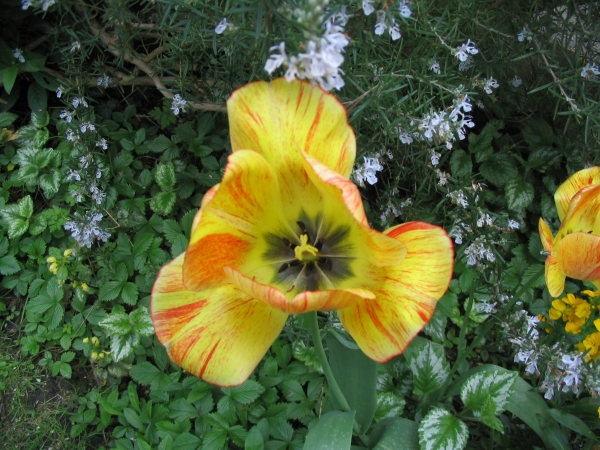
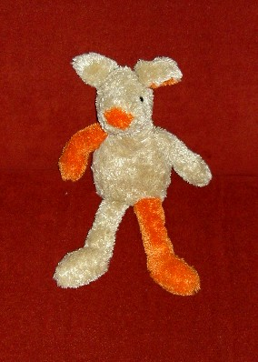

# Foreground Segmentation and Poisson Blending

This project implements the GrabCut algorithm for foreground segmentation and utilizes Poisson Blending for background replacement. The goal is to accurately segment a foreground object from an image and seamlessly blend it with a new background, preserving texture and color.

## Introduction

This repository contains the implementation of both GrabCut and Poisson Blending algorithms, including code, example images, and a detailed report on the methodology and results.

## Methodology

### GrabCut Algorithm

1. **Initialization of GMMs**:
   - Initialize Gaussian Mixture Models (GMMs) for foreground and background using K-means clustering.

2. **Update GMMs**:
   - Calculate and update mean, covariance, and weights of GMM components based on the current mask.

3. **Min-Cut Calculation**:
   - Build a graph using the mask and energy terms, then compute the min-cut to segment the image.

4. **Mask Update**:
   - Update the mask based on the min-cut results.

5. **Convergence Check**:
   - Determine if the energy value has stabilized to a minimum.

6. **Evaluation Metric**:
   - Evaluate segmentation accuracy and Jaccard similarity against ground truth.

### Poisson Blending

1. **Laplacian Operator Calculation**:
   - Compute the Laplacian of the source image.

2. **Solve Poisson Equation**:
   - Solve the Poisson equation to blend the source and target images.

3. **Blend and Save Image**:
   - Blend the foreground object with the new background and save the result.

## Results

### Example Images
| Before | After |
|--------|-------|
| {: width="300px" height="200px"} | {: width="300px" height="200px"} |
| {: width="300px" height="200px"} | {: width="300px" height="200px"} |
| {: width="300px" height="200px"} | {: width="300px" height="200px"} |
| {: width="300px" height="200px"} | {: width="300px" height="200px"} |


### Detailed Report

A comprehensive report on the methodology and results can be found [here](report_examples/report.pdf).

## Repository Structure

```plaintext
data/imgs/
  ├── ... (input images)
data/seg_GT/
  ├── ... (ground truth binary images)
data/bg/
  ├── ... (background images)
data/bboxes/
  ├── ... (bounding boxes as txt files)
report_examples/
 ├── ... (example images and a detailed report)
grabcut.py
poisson_blend.py
README.md
